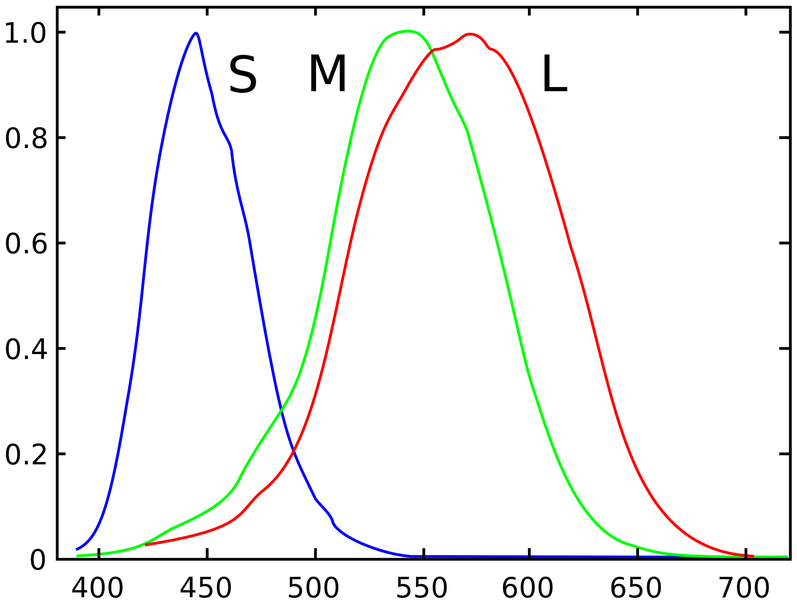
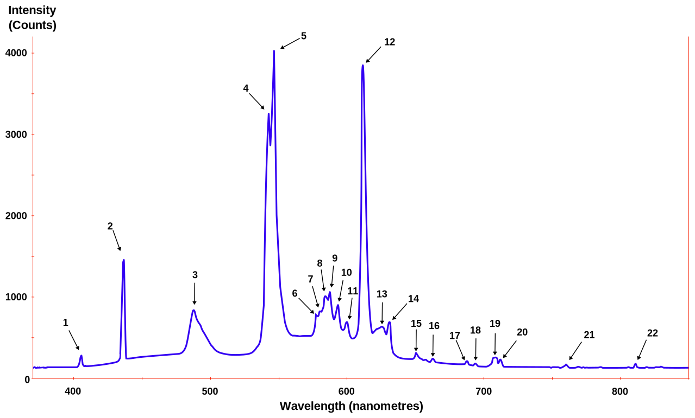

Background Material
*******************
Color
=================================
One of the most easy and yet difficult properties of an object is its color. 
From a young age we can already describe our world with words like red, amaranth red, auburn, crimson, etc. In highschool we've learned that light is the visible part of the electromagnetic spectrum, ranging from 390 nm (violet) to 700 nm (red) and that if white light is being refracted by a prism, a rainbow of colors appears.
So color seems to correlate with a specific wavelength. This is however an oversimplification.

We humans typically have 3 types of cells in our eyes to distiguish color. Some men have 2, some women even have 4, but most of us have 3. 

   Normalized typical human cone cell responses (S, M, and L types) to monochromatic spectral stimuli. By Vanessaezekowitz at en.wikipedia, CC BY-SA 3.0, https://commons.wikimedia.org/w/index.php?curid=10514373

A spectrum of light is being filtered in 3 different ways. First consider a spectral power distribution curve (of the light that is falling in our eye at a specific solid angle) 

   The spectral density of a fluorescent light as a function of optical wavelength shows peaks at atomic transitions, indicated by the numbered arrows. Original:  Deglr6328 at English Wikipedia Derivative work:  RicHard-59 [CC BY-SA 3.0 (http://creativecommons.org/licenses/by-sa/3.0/)]

This light is filtered by our cones (ie. the SPD is multiplied by the S, M or L filtering function) Then, the integral across the entire spectrum is taken (ie. the area beneath the resulting curve of the multiplication) The end result are 3 numbers, the so called tristimulus values. The entire spectral power distribution curve is being compacted into 3 numbers, that we use to figure out the color.

A specific color can correspond to an infinite amount of spectral power distributions. This effect is called [metamerism]_

The perceived color of light depends on the shape of our cone cell responses. Luckily this doesn't change too much from one person to the other, so that a standard observer model can be reconstucted [CIE1931]_.

Our cameras and displays are modelled according to how we perceive the world, so the most commonly used scheme involves red, green and blue pixels. Note that if the red, green and blue filters of our cameras have different responses than our eyes (and the responses are different), we will never capture the world in the same way as we see it. Moreover, if our screens aren't properly calibrated, even if the red, green and blue values were correct, they still won't be properly turned into a light source that is a metamer of our captured spectrum.

Multi Spectral Imaging
=================================
Instead of only capturing the spectral power distribution of the reflected light with 3 values, why not use more? Or different ones? Advances in LED technology have made it possible for PLD and RTI technology to illuminate objects not only with white LEDs, but also with near infrared and near ultraviolet LEDs.

PLD's multi spectral domes are equipped with 5 different narrow band LEDs: near infrared, red, green, blue and near ultraviolet.

Long Term Preservation
=================================
First some bad news. The LA Times has written an item about this approximately 30 years ago: https://www.latimes.com/archives/la-xpm-1991-01-13-mn-232-story.html Some archivists fear a digital dark age [DigitalDarkAge]_.
Whether a new digital dark age is coming, is still unclear, though it seems our technology is currently not suited for long term preservation. Think about the photos of your grandparents and parents. We now shoot a multitude of our family, but will our offspring be able to see them in the coming decades?

Many of the objects that have been scanned with RTI or PLD are much older than the oldest bit of digital data. By digitizing our artefacts, scholars can study the digital copies, whereas the real artefact can be safely stored. But how can we preserve our digital copies for long term?
Sadly we can't, but we can follow certain strategies to maximixe our chances.
Firstly, we have to be sure that the physical medium on which we store our data keeps the data's integrity and that the filesystem can still be read. 
Secondly, we cannot rely on the fact that software that is written now will still work in the future. Much better than opening a binary blob of data with a binary executable, we have to describe in plain text how to parse and interpret our stored data.

glTF
-------
commonly used filetypes

.. rubric:: Footnotes

.. [metamerism] https://en.wikipedia.org/wiki/Metamerism_(color)
.. [CIE1931] https://en.wikipedia.org/wiki/CIE_1931_color_space
.. [DigitalDarkAge] https://en.wikipedia.org/wiki/Digital_dark_age
