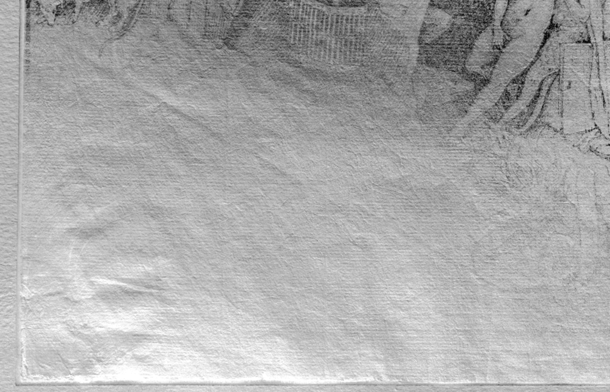
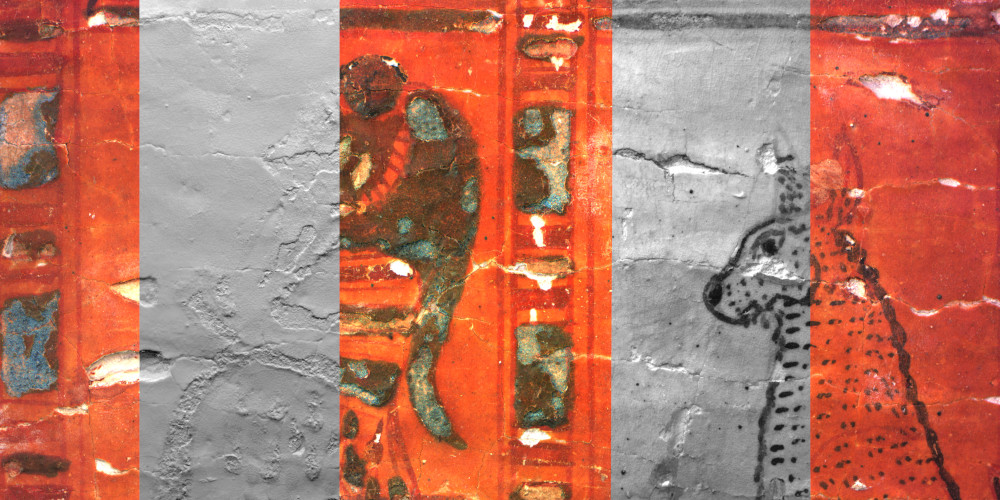

Examples
********

Plan of Sankt Gallen
====================
.. figure:: _static/images/samples_stgallen.jpg
   :figwidth: 25%

   This is the caption of POSG
Background
----------

What can be seen in this multi light single camera scan?
---------------------------------------------------------

Open in web viewer
------------------

`glTF <https://homes.esat.kuleuven.be/~vvanwedd/pixelplusviewer/viewer.php?file=data%2Fsamples%2Fstgallen%2Finfo.gltf>`_

Bruegel
==========
Background
-----------

© KBR: Detail on original Bruegel drawing (SII132816, Luxuria)

This is the background of this work of art.

What can be seen in this multi light single camera scan?
---------------------------------------------------------

Open in web viewer
------------------

`Multi Spectral ZUN <https://homes.esat.kuleuven.be/~vvanwedd/pixelplusviewer/viewer.php?file=data%2Fsamples%2FKBR_Bruegel%2Fbruegel.zun>`_

Coin
==========
Background
-----------

   This is the caption of coin

This is the background of this work of art.

What can be seen in this multi light single camera scan?
---------------------------------------------------------

Open in web viewer
------------------

`White light ZUN <https://homes.esat.kuleuven.be/~vvanwedd/pixelplusviewer/viewer.php?file=data%2Fsamples%2FKBR_Coin%2Fcoin.zun>`_

`HSH RTI <https://homes.esat.kuleuven.be/~vvanwedd/pixelplusviewer/viewer.php?file=data%2Fsamples%2FKBR_Coin%2Fcoin.rti>`_

`glTF <https://homes.esat.kuleuven.be/~vvanwedd/pixelplusviewer/viewer.php?file=data%2Fsamples%2FKBR_Coin%2FglTF%2Finfo.gltf>`_

Cuneiform tablet
================
Background
-----------

.. figure:: _static/images/sample_cuneiform.jpg
   :figwidth: 75%

   This is the caption of Cuneiform

This is the background of this work of art.

What can be seen in this multi light single camera scan?
---------------------------------------------------------

Open in web viewer
------------------

`White light ZUN <https://homes.esat.kuleuven.be/~vvanwedd/pixelplusviewer/viewer.php?file=data%2Fsamples/KMKG_cuneiformtablet/cuneiformtablet.zun>`_

Bible of Anjou
==============
Background
-----------

.. figure:: _static/images/samples_bibleOfAnjou.png
   :figwidth: 50%

   Anjou Bible, fol. 3v, ‘REX EXPERTUS IN OMNI SCIENCIA’. King Robert enthroned, robed in a Byzantine-style imperial costume,with four virues crushing four vices on either side of him.

.. figure:: _static/images/samples_bibleOfAnjou_shaded.png
   :figwidth: 50%

   Anjou Bible, fol. 3v, ‘REX EXPERTUS IN OMNI SCIENCIA’. King Robert enthroned, robed in a Byzantine-style imperial costume,with four virues crushing four vices on either side of him.

What can be seen in this multi light single camera scan?
---------------------------------------------------------

?? King Robert ??

Open in web viewer
------------------

`White Light ZUN <https://homes.esat.kuleuven.be/~vvanwedd/pixelplusviewer/viewer.php?file=data%2Fsamples%2FKUL_bible_of_Anjou%2FSABBE_MS1_003V_1.3x.zun>`_

`Multi Spectral ZUN <https://homes.esat.kuleuven.be/~vvanwedd/pixelplusviewer/viewer.php?file=data%2Fsamples%2FKUL_bible_of_Anjou%2FGBIB_MS1_001V_MS_01.3x.zun>`_

Rijmbijbel
==========
Background
-----------

.. figure:: _static/images/samples_rijmbijbel_RGBandIR.jpg
   :figwidth: 25%

© KBR: Detail of illumination on folio 106 verso of Rijmbijbel of Jacob van Maerlant(ca. 1225-1291) `MS15001 <https://opac.kbr.be/Library/doc/SYRACUSE/17000895/rijmbijbel-ms-15001>`_ 

What 
----
By comparing the RGB rendering to the left (how the object appears to the human eye) with the rendering based on the reflections from the 850nm infrared light sources (to the right) in a multispectral single-camera multi-light acquisition dome, it can be observed the faces of the figures in the illumination have been repainted with different pigments, compared to the original materials.  

Open in web viewer
------------------

`Multi Spectral ZUN <https://homes.esat.kuleuven.be/~vvanwedd/pixelplusviewer/viewer.php?file=data%2Fsamples%2FKUL_rijmbijbel%2Frijmbijbel.zun>`_

Egyptian coffin
===============
Background
-----------

   Egyptian coffin

What can be seen in this multi light single camera scan?
---------------------------------------------------------

?? Egyptian coffin ??

Open in web viewer
------------------

`Multi Spectral ZUN <https://homes.esat.kuleuven.be/~vvanwedd/pixelplusviewer/viewer.php?file=data%2Fsamples%2FKMKG_egyptiancoffin%2Fegyptiancoffin.zun>`_

Charles V seal
==============

.. figure:: _static/images/samples_charlesVSeal.gif
   :figwidth: 50%

   Charles V Seal

What can be seen in this multi light single camera scan?
---------------------------------------------------------

?? Charles V Seal ??

Open in web viewer
------------------

`White Light ZUN <https://homes.esat.kuleuven.be/~vvanwedd/pixelplusviewer/viewer.php?file=data%2Fsamples%2FKUL_charlesvseal%2Fcharlesvseal.zun>`_

`HSH RTI <https://homes.esat.kuleuven.be/~vvanwedd/pixelplusviewer/viewer.php?file=data%2Fsamples%2FKUL_charlesvseal%2Fcharlesvseal.rti>`_

`PTM <https://homes.esat.kuleuven.be/~vvanwedd/pixelplusviewer/viewer.php?file=data%2Fsamples%2FKUL_charlesvseal%2Fcharlesvseal.ptm>

`glTF <https://homes.esat.kuleuven.be/~vvanwedd/pixelplusviewer/viewer.php?file=data%2Fsamples%2FKUL_charlesvseal%2FglTF%2Finfo.gltf>`_

Japanese Print
==============

   Japanese Print

What can be seen in this multi light single camera scan?
---------------------------------------------------------

Japanese print

Open in web viewer
------------------

`White Light ZUN <https://homes.esat.kuleuven.be/~vvanwedd/pixelplusviewer/viewer.php?file=data%2Fsamples%2FKUL_japaneseprint%2Fjapaneseprint.zun>`_

`HSH RTI <https://homes.esat.kuleuven.be/~vvanwedd/pixelplusviewer/viewer.php?file=data%2Fsamples%2FKUL_japaneseprint%2Fjapaneseprint.rti>`_

`glTF <https://homes.esat.kuleuven.be/~vvanwedd/pixelplusviewer/viewer.php?file=data%2Fsamples%2FKUL_japaneseprint%2FglTF%2Finfo.gltf>`_

.. IR.1034 RTI
.. ===========

.. `glTF cuneiform tablet example <http://homes.esat.kuleuven.be/~vvanwedd/pixelplusviewer/viewer.php?file=data/samples/glTF/info.gltf>`_

