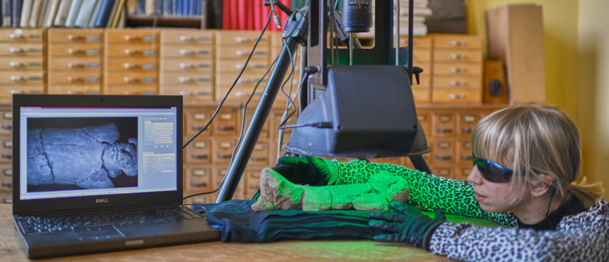

Introduction
**********************
The heritage-visualisation.org website is an initiative of the pixel+ project to promote enhanced visualisation solutions for the heritage community. It provides an overview of heritage scanning methods and focusses on one in particular: Single-Camera, Multi-Light technology.

Several methods to capture and study heritage artifacts with the Single-Camera, Multi-Light technology exist. This website aims to bring together existing methods. To achieve this an integrated viewer platform has been created.

The website hosts the WebGL based `pixel+ viewer <http://www.heritage-visualisation.org/viewer>`_ which can handle several single-camera, multi-light datasets. This viewer allows the consultation of existing CUN, ZUN, PTM and RTI datasets and as a first uses the newly proposed glTF `glTF <http://www.heritage-visualisation.org/gltf.rst>`_ file format standard.

heritage-visualisation.org is maintained by a group of researchers in the Computer Vision and Cultural Heritage domains. The group focuses on the development and dissemination of new technologies for visualisation and has its origin in Belgium.

.. Toctree::
   :hidden:

   heritagevisualisationmethods

   A Single-Camera Multi-Light recording with a multispectral acquisition device (MS Microdome) of an Egyptian execration figurine (Art & History Museum `E.7442 <https://www.carmentis.be:443/eMP/eMuseumPlus?service=ExternalInterface&module=collection&objectId=84503&viewType=detailView>`_)

