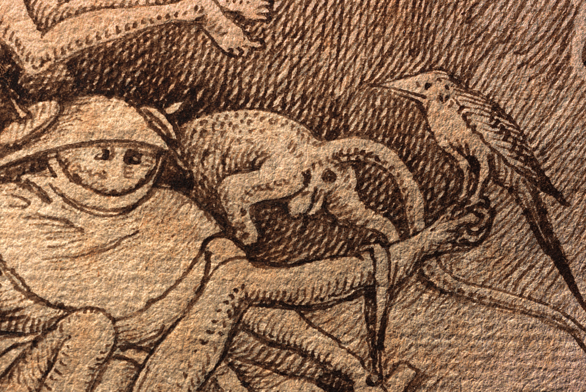

Dutch press text

   <h2>Nieuwe dimensies werpen verdiepende blik op erfgoed</h2>

Nieuwe dimensies werpen verdiepende blik op erfgoed
*************************************

   <h4>De KU Leuven lanceert samen met het Museum Kunst & Geschiedenis en de Koninklijke Bibliotheek van België (KBR) een online open access toepassing om erfgoedobjecten dynamisch en op een interactieve manier online te bekijken. Deze pixel+ viewer laat toe om eeuwenoude objecten in een ander licht te bekijken en verborgen details zichtbaar te maken. </h4> 

Naar aanleiding van de Coronavirus maatregelen zijn musea en andere erfgoedinstellingen vandaag nog nauwelijks toegankelijk, zowel in België, als in het buitenland. Het zet de consultatie van objecten en studie van ons verleden stevig onder druk. Voor een deel kan er terug gevallen worden op gedigitaliseerde objecten, notities en oude publicaties. Toch geven deze maar een deel van de informatie weer en kunnen zo belangrijke details over het hoofd gezien worden. Gelukkig staat de sector, in samenwerking met ingenieurs, technologisch klaar om ook deze situatie de baas te kunnen.
In de erfgoedsector wordt reeds lang ingezet op en geëxperimenteerd met de digitalisering van objecten. Het resulteert voor het publiek meestal in een online foto die ingezoomd of waarop het contrast aangepast kan worden. Dit zijn louter kleurenbeelden, want meer informatie zit er niet in standaard digitale foto’s. Verschillende soorten beeldscanners registreren intussen echter heel wat meer karakteristieken van een oppervlak dan alleen de kleur. Ook die informatie kunnen visualiseren in een handige online tool biedt dan ook nieuwe mogelijkheden voor iedereen die met erfgoed objecten werkt. Denk bijvoorbeeld aan de tekeningen van KBR van Pieter Bruegel de Oude die recent door de KU Leuven onder de loep werden genomen. De onderzoekers konden het papier tot op de vezel bestuderen met behulp van hun Portable Light Dome (PLD) scanner. Ze kregen ook een veel beter zicht op het uitgebreide palet aan technieken die de oude meester gebruikte. 

   Detail op originele Pieter Bruegel de Oude tekening uit 1557 (KBR: II132816, Luxuria), zonder kleur worden de ingedrukte stylussporen van de graveur zichtbaar (© Fingerprint, KBR en KU Leuven).

.. raw:: html

   <h3>Software is de sleutel</h3>

In de afgelopen 15 jaar ontwikkelden onderzoekers van de KU Leuven, samen met verschillende partners uit de erfgoedsector, digitale technieken die objecten tot op een ongezien gedetailleerd niveau in beeld kunnen brengen: de PLD scanner. “Met deze methode belichten ze een object vanuit een groot aantal hoeken en maken er telkens foto’s van, de zogenaamde ‘single-camera, multi-light recording’, zegt Hendrik Hameeuw, mede-coördinator van het project aan de KU Leuven. “De manier waarop deze opname nadien verwerkt wordt, bepaalt welke karakteristieken van het oppervlak, zoals reliëf of textuur, de software kan laten zien en dus hoe de gebruiker het object ervaart.” 

.. raw:: html

   <h3>Nieuw universeel bestandsformaat</h3>

“Om helemaal volledig te zijn, moeten we eigenlijk kijken naar de bestandstypes van deze interactieve datasets”, zegt Hameeuw. De meeste erfgoedinstellingen berekenen en bewaren dit type beelden van hun erfgoed met specifiek beeldformaat, meestal is dat RTI/HSH. De software die in Leuven ontwikkeld werd, werkt met PLD-files (ZUN, CUN) die extra toepassingen ten opzichte van die RTI/HSH bestanden heeft. Pixel+ maakt deze manier van berekenen nu beschikbaar voor de hele wereld, niet alleen door het online aan te bieden, maar ook door er een nieuw soort containerbestand voor te introduceren: SCML. “Vergelijk het met een gewone foto op je computer. Waarschijnlijk zal dat een JPEG- of GIF-bestand zijn. Maar wil je ermee aan de slag in Photoshop, dan maakt het programma van dezelfde afbeelding een PSD-bestand.” Deze SCML-bestanden zijn compatibel met zowel de Leuvense PLD als met de RTI/HSH bestanden. “Hiermee bieden we een nieuwe universele standaard aan voor dit soort beelden en ontsluiten we ze ook meteen via de online pixel+ viewer, een soort gratis photoshop voor ‘single-camera, multi-light recording’ beelden.” Hierdoor kunnen zowel RTI/HSH als PLD bestanden voor het eerst binnen éénzelfde programma bestudeerd en vergeleken worden.

.. raw:: html

   <h3>Een nieuwe wereld</h3>

Pixel+ haalt heel wat extra informatie uit de beschikbare data. De voorwerpen, zoals oude munten, miniaturen of schilderijen, krijgen zo na honderden jaren plots extra dimensies die voor het onderzoek op dergelijke objecten nieuwe inzichten kan verwerven. Vooral op het vlak van 3D (geometrie) en het correct begrijpen van de reflecties van licht op een object zet de Leuvense software grote stappen vooruit. 

“De technologie is interessant voor tal van objecten, van kleitabletten over munten tot schilderijen of middeleeuwse manuscripten”, licht Hameeuw toe. “De software laat onder andere toe om de objecten virtueel met verschillende lichtinvallen te bekijken, het reliëf op pixelniveau in kaart te brengen of een 3D-visualisatie te genereren.” Door het zelfs te combineren met multi-spectrale beeldvorming kwamen onderzoekers er bijvoorbeeld achter dat de hoofden van enkele figuren in de 13de eeuwse Rijmbijbel van KBR op een later moment werden overschilderd. Aan het Museum Kunst & Geschiedenis werd de technologie dan weer ingezet om sterk verweerde teksten op bijna 4000 jaar oude Egyptische beeldjes opnieuw leesbaar te maken.
 
.. figure:: _static/images/samples_rijmbijbel_RGBandIR.jpg
   :scale: 10 %
   :alt:

   Zelfde detail van illuminatie op folio 106 (verso) in de Rijmbijbel van Jacob van Maerlant (MS15001, ca. 1225-1291) met variërende visualisaties van multi-spectrale PLD dataset (© KBR en KU Leuven).

Instellingen uit de hele wereld, van het Metropolitan Museum of Art in New York (VS) tot het Regionaal Archeologisch Museum a/d Schelde in Avelgem, zullen hun eigen datasets of bestanden kunnen opladen, consulteren en bestuderen in pixel+. De software zet de informatie volgens verschillende nieuwe standaarden om en laat gebruikers toe de virtuele erfgoedobjecten interactief te ontsluiten. “Deze ontwikkeling is echt een mijlpaal voor de erfgoedsector”, benadrukt Chris Vastenhoud, promotor van het project vanuit het Museum Kunst & Geschiedenis. “Er zal een hele nieuwe wereld open gaan voor erfgoedinstellingen wereldwijd. Ze zullen heel wat bijkomende informatie kunnen documenteren en delen om zo te communiceren over de objecten in hun collecties.”

Pixel+ is voor iedereen beschikbaar op http://www.heritage-visualisation.org met voorbeelden van objecten uit de collecties van het Museum Kunst & Geschiedenis, KBR en de KU Leuven.

.. figure:: _static/images/news_viewer.png
   :scale: 40 %
   :alt:

   De online pixel+ viewer met voorbeeld van een spijkerschrifttablet uit de collectie van het Museum Kunst & Geschiedenis, Brussel. (© Museum Kunst & Geschiedenis en KU Leuven).

Het project is een samenwerking van Museum Kunst & Geschiedenis, KU Leuven Departement Elektrotechniek, KU Leuven Illuminare, KU Leuven Bibliotheken Digitalisering en KBR; en werd gefinancierd door het Federaal Wetenschapsbeleid (BELSPO) via het BRAIN-be programma (Pionier projecten).

Contactlijst alle betrokken partners: 

* Hendrik Hameeuw, KU Leuven Bibliotheken – Digitalisering en Document Delivery, 016 32 47 46, hendrik.hameeuw@kuleuven.be 
* Marc Proesmans, KU Leuven, departement Elektrotechniek (ESAT), 016 32 10 43 Marc.Proesmans@esat.kuleuven.be 
* Chris Vastenhoud, KMKG eCollections, 02 741 72 51, c.vastenhoud@kmkg-mrah.be
* Lieve Watteeuw, Illuminare, Studiecentrum voor Middeleeuwse Kunst, 016 37 24 94, lieve.watteeuw@kuleuven.be
* Frédéric Lemmers, KBR Digitisation Department,  02 519 56 64,  frederic.lemmers@kbr.be 

Begin april 2020 presenteerden de projectmedewerkers van pixel+ reeds hun resultaten tijdens een online (ten gevolge Corona) SPIE-conferentie. Naar aanleiding daarvan de publicatie van onderstaande paper:  
Vincent Vanweddingen, Hendrik Hameeuw, Bruno Vandermeulen, Chris Vastenhoud, Lieve Watteeuw, Frédéric Lemmers, Athena Van der Perre, Paul Konijn, Luc Van Gool, Marc Proesmans 2020: Pixel+: integrating and standardizing of various interactive pixel-based imagery, in: Peter Schelkens, Tomasz Kozacki (eds.) Optics, Photonics and Digital Technologies for Imaging Applications VI, Proc. of SPIE Vol. 11353, 113530G. (DOI: 10.1117/12.2555685)
lees paper – bekijk presentatie

Extra voorbeelden kunnen bekeken en aangemaakt worden op http://www.heritage-visualisation.org/examples.html

       
