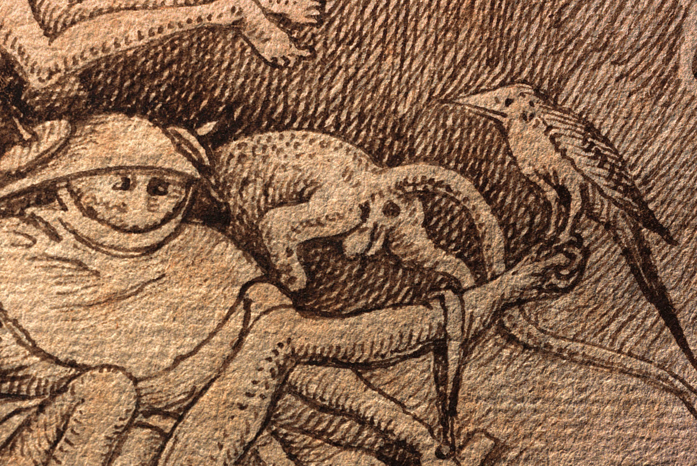
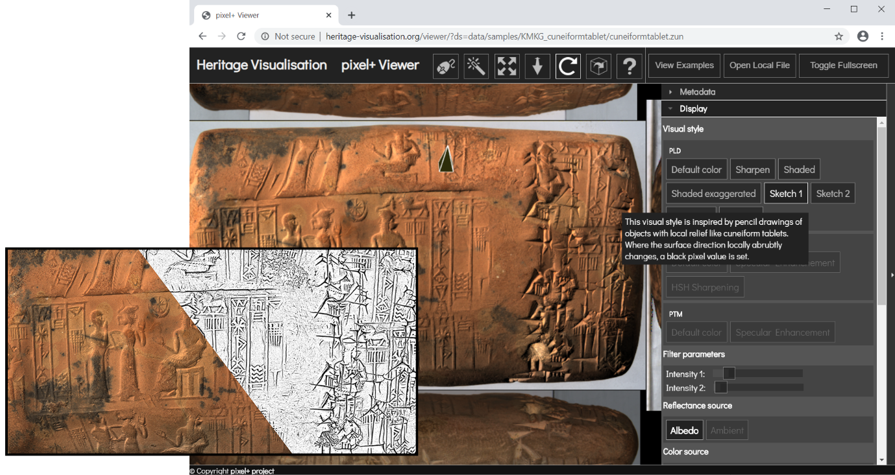

French press text
*************************************
.. raw:: html

   <h2>De nouvelles dimensions pour un regard plus approfondi sur le patrimoine<h2>

   <h4>En collaboration avec le Musée Art & Histoire et KBR (Bibliothèque royale de Belgique), la KU Leuven lance une application en ligne en libre accès permettant de visualiser des objets du patrimoine de manière dynamique et interactive. Cette visionneuse Pixel+ permet de voir des objets séculaires sous un autre angle et de révéler des détails cachés.</h4>

En raison des mesures de lutte contre le Coronavirus, les musées et autres institutions patrimoniales sont aujourd'hui difficilement accessibles, tant en Belgique qu'à l'étranger. Cela met la consultation des objets et l'étude de notre passé sous forte pression. Nous pouvons en partie nous rabattre sur des objets numérisés, des notes et d'anciennes publications. Néanmoins, ceux-ci ne représentent qu'une partie des informations et des détails importants peuvent donc être négligés. Heureusement, le secteur, en collaboration avec des ingénieurs, est également prêt sur le plan technologique à faire face à cette situation.

Dans le secteur du patrimoine, la numérisation des objets a longtemps été au centre de l'attention et de l'expérimentation. Pour le public, cela se traduit généralement par une photo en ligne qui peut être zoomée ou sur laquelle le contraste peut être ajusté. Ce sont des images purement en couleur, car les photos numériques standard ne contiennent pas plus d'informations. Cependant, les différents types de scanners d'images enregistrent beaucoup plus de caractéristiques d'une surface que la couleur seule. Pouvoir visualiser ces informations dans un outil en ligne pratique offre donc de nouvelles possibilités à toute personne travaillant avec des objets patrimoniaux. Pensez, par exemple, aux dessins de Pieter Bruegel l'Ancien de la KBR qui ont été récemment examinés par la KU Leuven. Les chercheurs ont pu étudier le papier jusqu'à la fibre à l'aide de leur scanner Portable Light Dome (PLD). Ils ont également eu une bien meilleure vision de la vaste gamme de techniques utilisées par l’ancien maître. 

   Détail sur le dessin original de Pieter Bruegel l'Ancien de 1557 (KBR : II132816, Luxuria), sans couleur, les traces stylistiques imprimées du graveur deviennent visibles (© Fingerprint, KBR et KU Leuven).

   .. raw:: html

   <h3>Le logiciel est la clé</h3>

Au cours des 15 dernières années, les chercheurs de la KU Leuven, en collaboration avec divers partenaires du secteur du patrimoine, ont mis au point des techniques numériques permettant de visualiser des objets à un niveau de détail sans précédent : le scanner PLD. "Avec cette méthode, ils éclairent un objet sous un grand nombre d'angles et prennent des photos de celui-ci, ce que l'on appelle "l'enregistrement single-camera, multi-light", explique Hendrik Hameeuw, coordinateur du projet pixel+ à la KU Leuven. "La manière dont cet enregistrement est ensuite traité détermine les caractéristiques de la surface, telles que le relief ou la texture, que le logiciel peut montrer et donc la manière dont l'utilisateur perçois l'objet". 

.. raw:: html

   <h3>Nouveau format de fichier universel</h3>

"Pour être entièrement complets, nous devons en fait examiner les types de fichiers de ces ensembles de données interactifs", explique Hameeuw. La plupart des institutions patrimoniales calculent et stockent ces types d'images de leur patrimoine avec un format d'image spécifique, généralement RTI/HSH. Le logiciel développé à Louvain fonctionne avec les fichiers PLD (ZUN, CUN) qui ont des applications supplémentaires par rapport à ces fichiers RTI/HSH. Pixel+ met désormais ce mode de calcul à la disposition du monde entier, non seulement en le proposant en ligne, mais aussi en introduisant pour lui un nouveau type de fichier conteneur : SCML. "Comparez avec une photo ordinaire sur votre ordinateur. Il s'agira probablement d'un fichier JPEG ou GIF. Mais si vous voulez l'utiliser dans Photoshop, le programme transformera la même image en fichier PSD". Ces SCML sont compatibles avec le PLD de Leuven et les fichiers RTI/HSH. "Nous proposons ainsi une nouvelle norme universelle pour ce type d'images et nous les rendons immédiatement accessibles via le visionneuse en ligne pixel+, une sorte de photoshop gratuit pour les images 'single-camera, multi-light". Cela permet d'étudier et de comparer pour la première fois les dossiers RTI/HSH et PLD au sein d'un même programme.

.. raw:: html

   <h3>Un monde nouveau</h3>

Pixel+ extrait de nombreuses informations supplémentaires des données disponibles. Les objets, tels que les vieilles pièces de monnaie, les miniatures ou les peintures, acquièrent soudainement, après des centaines d'années, des dimensions supplémentaires qui peuvent être utilisées pour la recherche sur ces objets afin d'acquérir de nouvelles connaissances. En particulier dans le domaine de la 3D (géométrie) et de la bonne compréhension des réflexions de la lumière sur un objet, le logiciel de Leuven fait de grands pas en avant. 
"La technologie est intéressante pour de nombreux objets, des tablettes d'argile aux pièces de monnaie en passant par les peintures ou les manuscrits médiévaux", explique H. Hameeuw. "Le logiciel permet, entre autres, de visualiser virtuellement les objets avec différentes incidences lumineuses, de cartographier le relief au niveau du pixel ou de générer une visualisation 3D". En le combinant avec l'imagerie multispectrale, les chercheurs ont découvert, par exemple, que les têtes de certaines des figures de la Rijmbijbel du 13e siècle de la KBR ont été peintes par-dessus à une date ultérieure. Au Musée Art & Histoire, la technologie a été utilisée pour rendre à nouveau lisibles des textes très altérés sur des figurines égyptiennes vieilles de près de 4000 ans. 

.. figure:: _static/images/samples_rijmbijbel_RGBandIR.jpg
   :scale: 10 %
   :alt:

   Même détail de miniature (folio 106v) dans le Rijmbijbel de Jacob van Maerlant (MS15001, ca. 1225-1291) avec différentes visualisations du PLD multispectral, remarquez les lignes rouges autour des têtes (= ajouts postérieurs) (© KBR et KU Leuven).

Des institutions du monde entier, du Metropolitan Museum of Art à New York (USA) au Regionaal Archeologisch Museum a/d Schelde à Avelgem, pourront télécharger, consulter et étudier leurs propres ensembles de données ou fichiers en pixel+. Le logiciel convertit les informations selon diverses nouvelles normes et permet aux utilisateurs d'accéder aux objets du patrimoine virtuel de manière interactive. "Ce développement est vraiment une étape importante pour le secteur du patrimoine", souligne Chris Vastenhoud, promoteur du projet au Museum of Art & History. "Un tout nouveau monde s'ouvrira pour les institutions du patrimoine du monde entier. Ils pourront documenter et partager de nombreuses informations supplémentaires afin de communiquer sur les objets de leurs collections".

Pixel+ est accessible à tous sur http://www.heritage-visualisation.org avec des exemples d'objets provenant des collections du Musée Art & Histoire, KBR et KU Leuven.

   La visionneuse pixel+ en ligne avec un exemple de tablette cunéiforme de la collection du Musée Art & Histoire de Bruxelles. (© Musée Art & Histoire et KU Leuven).
Le projet est une collaboration de Musée Art & Histoire, du département d'électrotechnique de la KU Leuven, de Illuminare, Centre for the Study of Medieval Art, KU Leuven Libraries Digitalisation et KBR; il a été financé par le Bureau de la politique scientifique fédérale (BELSPO) dans le cadre du programme BRAIN-be (projets Pioneer).

Liste des contacts de tous les partenaires impliqués : 

* Hendrik Hameeuw, KU Leuven Bibliotheken – Digitalisering en Document Delivery, 016 32 47 46, hendrik.hameeuw@kuleuven.be 
* Marc Proesmans, KU Leuven, Département d'ingénierie électrique - ESAT, Marc.Proesmans@esat.kuleuven.be 
* Chris Vastenhoud, Musée Art & Histoire, eCollections, 02 741 72 51, c.vastenhoud@kmkg-mrah.be
* Lieve Watteeuw, Illuminare, Centre d'étude de l'art médiéval, 016 37 24 94, lieve.watteeuw@kuleuven.be
* Frédéric Lemmers, KBR Digitisation Department, 02 519 56 64, frederic.lemmers@kbr.be 

Début avril 2020, l'équipe du projet pixel+ a déjà présenté ses résultats lors d'une conférence SPIE en ligne (résultat de Corona). En conséquence, le document ci-dessous a été publié : 
Vincent Vanweddingen, Hendrik Hameeuw, Bruno Vandermeulen, Chris Vastenhoud, Lieve Watteeuw, Frédéric Lemmers, Athena Van der Perre, Paul Konijn, Luc Van Gool, Marc Proesmans 2020: Pixel+: integrating and standardizing of various interactive pixel-based imagery, in: Peter Schelkens, Tomasz Kozacki (eds.) Optics, Photonics and Digital Technologies for Imaging Applications VI, Proc. of SPIE Vol. 11353, 113530G. (DOI: 10.1117/12.2555685)
lire le document - voir la présentation

Des exemples supplémentaires peuvent être consultés et créés à http://www.heritage-visualisation.org/examples.html

      

