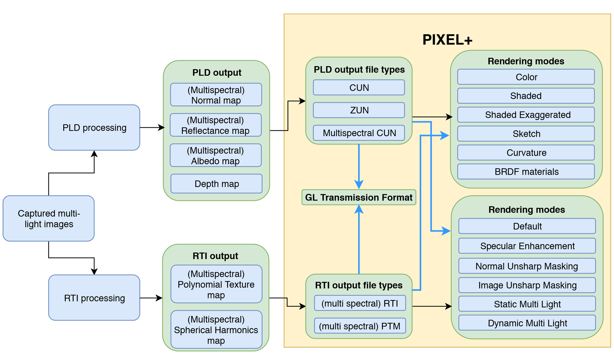

pixel+ Project
************

Motivation
==========
Researchers or museum curators who want to study, document or disseminate cultural artifacts have a vast toolbox of HD imaging methods and 3D scanners at hand. A careful choice must be made, depending on the shape, size, location and materiality of the artifact and which characteristic is of interest. The pixel+ project and viewer delivers solutions single-camera multi-light reflectance imaging methods. 

pixel+ aims to bring various existing single-camera multi-light reflectance scanning techniques closer together on several levels of integration:

* Existing processed RTI, PTM and PLD files can be opened in one web viewer with their respective viewing modes
* Existing processed RTI, PTM and PLD files can be reprocessed so that the viewing modes of the other technology become available.
* Existing RTI, PTM and PLD source data can be processed in both an RTI/PTM and a PLD pipeline.

>>>This document provides (background) information on various aspects of single-camera multi-light reflectance scanning techniques.

Integration
===========
Based on processed output files
-------------------------------

   Given the multitude of collections that have been scanned with both technologies, pixel+ allows to view processed files (cun, zun for PLD and ptm, rti for RTI) with filters of both technologies. It achieves this by calculating intermediate data file formats like normal maps and ambient maps.

Based on original input files
-------------------------------

 
   The best possible form of integration starts from the original input images as, compared to the previous integration method, no information is thrown away. Because both technologies require the same sort of input, i.e. a set of images lighted from various light directions, Pixel+ allows to apply both the PLD as well as the RTI pipeline on both RTI and PLD input data.

PLD is developed with the goal of doing scientific measurements and as such, as much is thouroughly calibrated. RTI itself isn't focussed on extracting surface properties, so using RTI source data to produce PLD results poses some challenges. 
  
Project funding
===============

In 2017 the `RMAH <https://www.artandhistory.museum>`_ and its partners in the pixel+ project received the necessary funding for the implementation of the goals set out. The `Belgian Science Policy Office (BELSPO) <https://www.belspo.be>`_ granted pixel+ this support via their BRAIN-be programme (Pioneer Projects). 

Project partners
================

* `Royal Museums of Art and History (RMAH) <http://www.kmkg-mrah.be/>`_ – coordinator
* `KU Leuven Department of Electical Engineering (ESAT) <https://www.esat.kuleuven.be/psi>`_
* `Illuminare <http://www.illuminare.be/team/>`_
* `KU Leuven Libraries (BD Digitalisering) <https://bib.kuleuven.be/BD/digitalisering-en-document-delivery/digitalisering/digitalisering>`_
* `Royal Library of Belgium (KBR) <https://www.kbr.be/en/>`_

Project timeline
=================
* Literature study of Single-Camera, Multi-Light scanning: Jan 2018 - Feb 2018
* Proof of concept implementation in OS viewer of PLD-RTI-PTM integration based on processed output files: Mar 2018 - Jun 2018
* Dissemination: Presenting "Pixel : Visualising Our Heritage." at DH Benelux 2018
* Proof of concept implementation in OS viewer of PLD-RTI-PTM integration based on original input files: Jul 2018 - Sep 2018
* pixel+ viewer: Framework + support for multi spectral + white light CUN/ZUN: Oct 2018 - Dec 2018
* Dissemination: Presenting Euromed 2018 paper + poster in Cyprus: Oct 2018
* Dissemination: Organizing workshop at Digital Heritage 2018 in San Francisco 
* Documentation of PLD technology: Jan 2019 - Feb 2019
* pixel+ viewer: implementation of PLD-RTI-PTM integration 1: Mar 2019 - May 2019
* glTF implementation: June 2019
* Dissemination web site: Framework + content: Jul 2019 - Oct 2019
* First version of web viewer and dissemination site online: Nov 2019
* Implementing changes to web viewer and dissemination site based on user's input: Dec 2019 - Present

Future work:

* glTF Conversion Tool: Feb 2020 - Mar 2020
* Dissemination: Optics, Photonics and Digital Technologies for Imaging Applications VI, SPIE Photonics Europe 2020 29 March 2020 - 2 April 2020
* pixel+ viewer: support for Relight RTI
* Meta data handling in glTF
* Saving of shader parameters

Publications
============

* Hameeuw, H., Vanweddingen, V., Van Gool, L., Proesmans, M., Vastenhoud, C., Van Der Perre, A., Vandermeulen, B. and Watteeuw, G. "Pixel : Visualising Our Heritage." 2018. DH Benelux.
* Vanweddingen, V., Vastenhoud, C., Proesmans, M., Hameeuw, H., Vandermeulen, B., Van der Perre, A., Lemmers, F., Watteeuw, L., Van Gool, L. "A Status Quaestionis and Future Solutions for Using Multi-Light Reflectance Imaging Approaches for Preserving Cultural Heritage Artifacts." Digital Heritage. Progress in Cultural Heritage: Documentation, Preservation, and Protection. EuroMed 2018. Lecture Notes in Computer Science, vol. 11197, 2018, pp. 204–211. (Best poster award)
* Hameeuw, H., Vanweddingen, V., Proesmans, M., Vastenhoud, C.,  Vandermeulen, B., Van der Perre, A., Watteeuw, L., Lemmers, F.,  Van Gool, L., Schroer, C., Mudge, M., Earl, G. "Portable Light Domes in PIXEL+: Acquisition, Viewing, and Analysis." Digital Heritage 2018 3rd International Congress & Expo (San Fransisco)
* Hameeuw, H., Vanweddingen, V.,  Vandermeulen, B., Vastenhoud, C., Watteeuw, L., Lemmers, F., Van der Perre, A., Konijn, P., Van Gool, L., Proesmans, M. "PIXEL+: integrating and standardizing of various interactive pixel-based imagery" SPIE Optics, Photonics and Digital Technologies for Imaging Applications VI 2020

